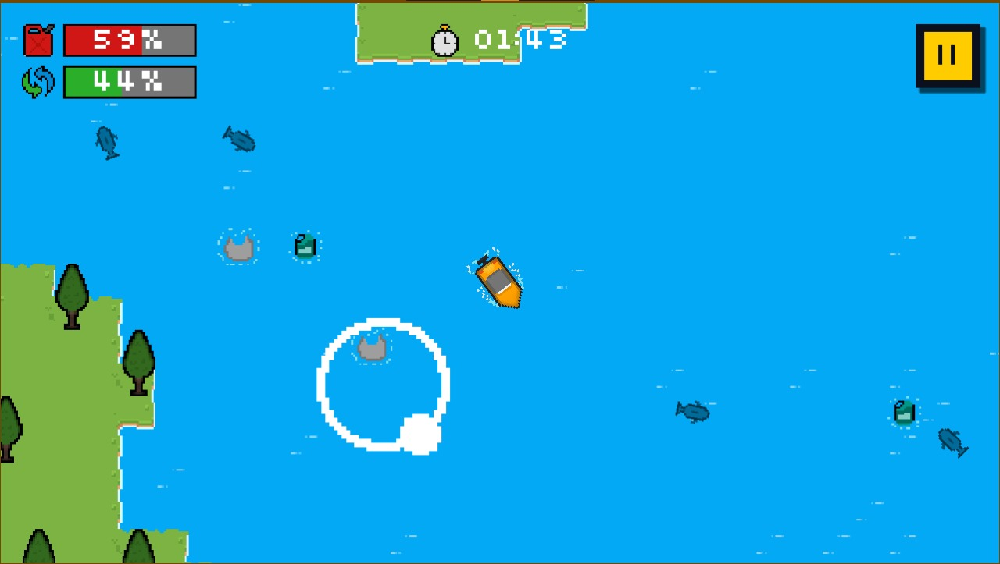
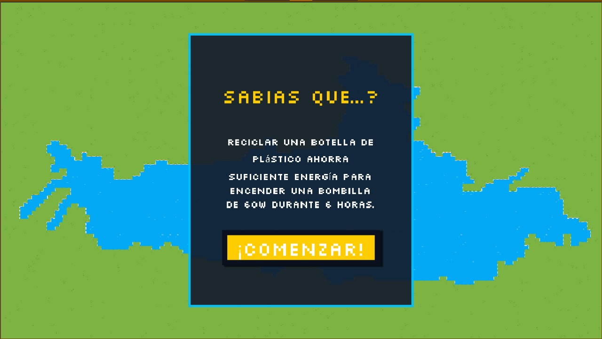

<h1 align="left">ESTANCIA II: BOAT-MOBILE</h1>
        

<h3 align="center"> Tecnologías Utilizadas</h3>

<p align="center">
  
  
  
  
  
  
</p>

Este proyecto fue desarrollado como parte de mi **Segunda Estancia** académica para la carrera de **Ingeniería en Sistemas Computacionales** en la **Universidad Politécnica de Apodaca**.
Consiste en una aplicación interactiva diseñada en **Godot Engine** usando el lenguaje **GDScript*** y una **Landing Page** responsiva, orientadas a la concienciación sobre la mitigación del impacto ambiental en cuerpos de agua locales.


<p align="center">
  
  <br>
  <em>Pantalla principal del juego.</em>
</p>


## Propósito
El propósito principal fue crear una herramienta interactiva que permita visualizar el impacto de la contaminación por plásticos en entornos locales como la **Presa La Boca** que sirve de escenario para el primer (y hasta el momento el único) nivel del juego. Esto le permite al usuario visualizar el beneficio ecológico de retirar plásticos del ecosistema mediante métricas de reducción de huella de carbono.

<p align="center">
  
  <br>
  <em>Captura del nivel tutorial del juego.</em>
</p>

## Características Técnicas 
Durante el desarrollo se implementaron soluciones técnicas específicas para garantizar un rendimiento óptimo en dispositivos móviles:

* **Sistema de Control Táctil:** Desarrollo de un joystick virtual dinámico configurado para detectar áreas táctiles específicas y un botón de turbo con gestión de energía.

<p align="center">
  
  <br>
  <em>Demostración del joystick virtual y la respuesta del entorno.</em>
</p>

* **Cálculo de Impacto Ambiental:** Implementación de una lógica matemática en el HUD para cuantificar la mitigación de $CO_2$ basada en el tipo de residuo recolectado:
    * **Botella (PET):** 50g de $CO_2$ mitigado.
    * **Bolsa de plástico:** 13g de $CO_2$ mitigado.
      
<p align="center">
  
  <br>
  <em>Métricas finales: Botellas + bolsas de plástico recolectadas = CO2 mitigado.</em>
</p>
  
* **Gestión de Memoria y Estado:** Uso de un `GameManager` para centralizar variables globales como combustible, puntaje y tiempo, evitando el acoplamiento directo entre escenas.
* **Interfaz de Usuario (UI/UX):** Creación de menús dinámicos, sistemas de pausa y pantallas de carga que muestran datos ambientales aleatorios para educar al usuario durante las transiciones.
  
<p align="center">
  
  <br>
  <em>La pantalla de carga integra el mapa real de la presa y datos educativos para el usuario.</em>
</p>


## Despliegue Web 
Se desarrolló una página de aterrizaje con estética **Pixel-Art** y estilo retro de 8 bits para servir como canal de distribución del proyecto:
* **Diseño Responsivo:** Adaptabilidad total a dispositivos móviles y escritorio mediante Media Queries.
* **Identidad Visual:** Integración de la fuente `Press Start 2P` y efectos de iluminación neón en CSS para mantener la cohesión con el arte del juego.
* **Distribución:** Sección dedicada para la descarga del archivo ejecutable y visualización de beneficios ambientales.


<p align="center">
  <em>Captura de pantalla de la pagina creada para el despliegue de la app.</em>
</p>

## Arquitectura del Proyecto
La organización del repositorio sigue un estándar modular para facilitar la escalabilidad y el mantenimiento:

```text
.
├── 📂android/                # Configuración para exportación a Android
├── 📂BOAT-PAGE/              # Código fuente de la pagina
├── 📂Escenas/                # Escenas de Godot (.tscn)
├── 📂Fuentes/                # Recursos de tipografía
├── 📂Iconos/                 # Logotipos
├── 📂Screenshots Readme/     # Capturas utilizadas en la documentación
├── 📂Scripts/                # Lógica del juego en GDScript
├── 📂Sprites/                # Assets visuales y arte 2D
├── 📂Tiles/                  # Mapas de mosaicos y terreno
├── 📄project.godot           # Archivo central del proyecto Godot
└── 📄README.md               # Documentación técnica
```
---
<p align="center">
  <b>¿Te gustó mi trabajo? ¡Conectemos!</b>
</p>

<p align="center">
  <a href="https://www.linkedin.com/in/maximo-juarez-rodríguez-8911b3327">
    
  </a>
  <a href="https://github.com/Mxim0-prog">
    
  </a>
  <a href="mailto:mxoju07@gmail.com">
    
  </a>
</p>


<p align="center">
  Desarrollado por <b>Maximo Juarez Rodriguez</b> – Estudiante de Ingeniería en Sistemas Computacionales, UPAPNL 2025.
</p>
